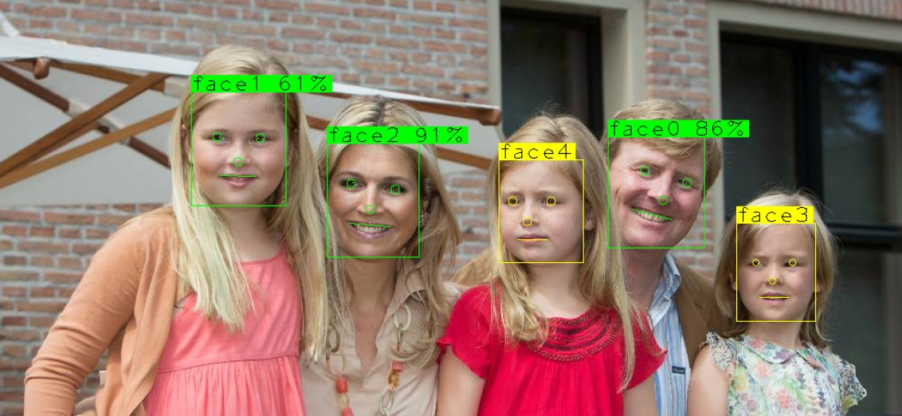
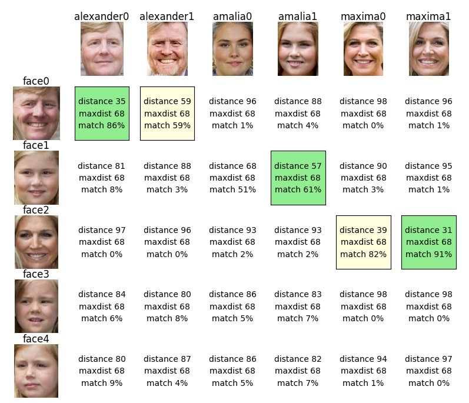
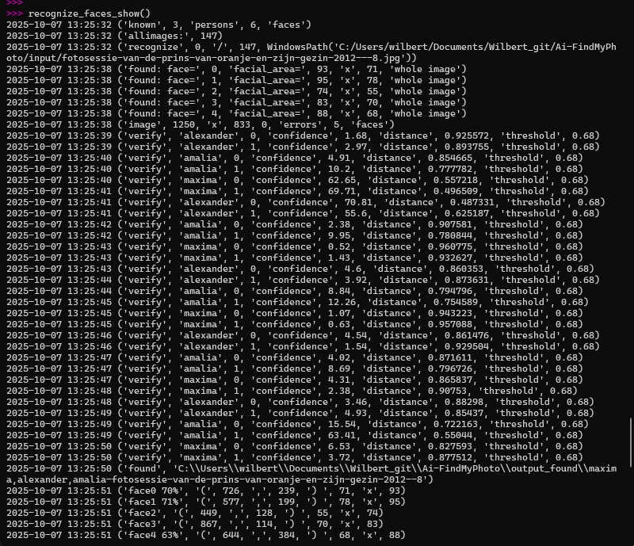

<!-- This is based on the markdown template for the final project of the Building AI course, created by Reaktor Innovations and University of Helsinki -->

# Ai Find My Photo

## Summary

You want to share some photos with a friend. However, over the years you have accumulated thousands of photos, how to find those that have your friend in it?

This is the final project for the freely available "Building AI" course (https://buildingai.elementsofai.com/).

## Background

This is a working demo. You should be able to make it run with minor effort. It is based on PyTorch, TensorFlow, DeepFace and other freely available libraries.

## How is it used?

### Prepare the system

#### Install Python

Note that this instruction is based on a Microsoft Windows system.

Install Python (3.13 was used)
* https://www.python.org/downloads/

#### Install libraries

PyTorch
* https://pytorch.org/get-started/locally/
* If you have an NVIDIA graphics card, you can use the CUDA version to allow your GPU beiing for extra processing power
* Select your configuration on the webpage and use the displayed pip install command

OpenCV
* https://opencv.org/

DeepFace
* https://github.com/serengil/deepface

MatplotLib
* https://matplotlib.org/

Open a command terminal and install the modules using pip commands, the latest versions will be installed:

```
pip install torch torchvision tf-keras
pip install opencv-python
pip install deepface
pip install matplotlib
```

Start the Python prompt with:

```
python
```

### Prepare the demo

#### Load the code on the Python prompt 

Copy/paste this to your Python command prompt (>>>) and press enter:

Note: modify 'dir_base' to match your folder.

Note: this will initialize the libraries, variables and functions, it will not start anything other than that.

```
dir_base = r'C:\Users\wilbert\Documents\Wilbert_git\Ai-FindMyPhoto'
exec(open( dir_base+'/FindMyPhoto.py' ).read())
```

#### Download example files --> ./input/*.jpg

Copy/paste this to your Python command prompt (>>>) and press enter:

Note: these are +-150 free-to-use photos of the Dutch royal family.

Note: the mentioned variables have been set in the previous step.

```
download_files(url_prefix, url_list, dir_input)
```

#### Start the proces

Note: if this is the first time you do this, then additional models will be downloaded automatically.

```
recognize_faces_show()
```

OpenCV marked image:



Matplot-grid with comparison results:



Example output log:




## Data sources and AI methods

PyTorch, TensorFlow and DeepFace were used along with other mainstream libraries.

The copyright of the used photos lies with the RVD. They may be downloaded free of charge for editorial use by news media, display in public spaces, private use, and educational purposes. 
Source: https://www.koninklijkhuis.nl/foto-en-video/fotos-koninklijk-gezin

## Challenges

It is quite easy to get a face recogniton program together based on pre-trained models, libraries like DeepFace and available examples. Finding faces in images works quite well but very obvious faces might still be missed. There are different results in subsequential runs and sometimes the functions seem to return invalid face-areas.

Nvidia CUDA allows you to use your Nvidia videocard for extra processing power (if you have one). I was not looking for realtime results but even with CUDS, the indexing of a large number of photos takes conciderable time. 

Comparing faces (verify) regularly misses the mark. However, there is still a lot that can be tried to improve matches, for example: normalize image size, use grayscale, change parameters, or try other models.

## Acknowledgments
* https://www.koninklijkhuis.nl/foto-en-video/fotos-koninklijk-gezin
* https://buildingai.elementsofai.com/
* https://www.codegenes.net/blog/face-detection-pytorch/
* https://pypi.org/project/deepface/
* many others


